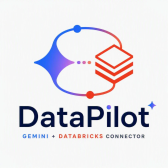
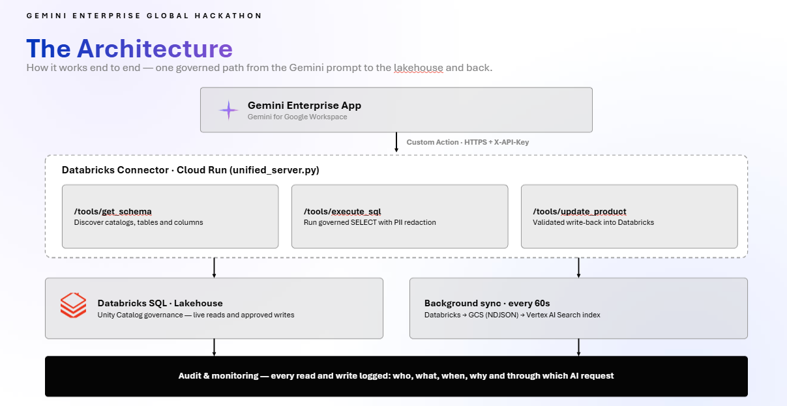

<div align="center">
  

  <h1>DataPilot</h1>
  <p><strong>Gemini · Databricks Connector</strong></p>
</div>

---

## Table of Contents

- [Team Members](#team-members)
- [Problem Statement](#problem-statement)
- [Solution](#solution)
- [Features](#features)
- [Architecture](#architecture)
- [Target Audience](#target-audience)
- [Project Structure](#project-structure)
- [Requirements](#requirements)
- [Quick Start](#quick-start)
- [Environment Variables](#environment-variables)
- [API Endpoints](#api-endpoints)
- [Local Development & Testing](#local-development--testing)
- [Deploy to Cloud Run](#deploy-to-cloud-run)
- [Attach to Gemini Enterprise](#attach-to-gemini-enterprise)
- [MCP Server](#mcp-server)
- [IAM Permissions](#iam-permissions)
- [Technical Architecture](#technical-architecture)
- [Security Notes](#security-notes)
- [Limitations](#limitations)
- [Useful Links & References](#useful-links--references)

---

## Team Members

- Chandra Sekhar Mangali
- MaheshBabu Hakeem
- Venkatesan S G
- YashPratap Singh
- Uday Nagisetti

---

## Problem Statement

Enterprise data teams store critical business data — inventory, products, transactions — inside **Databricks** lakehouses. Business users and AI assistants cannot query or update this data directly without writing SQL, setting up ETL pipelines, or waiting for manual exports. This creates a slow, error-prone gap between the data and the people who need it.

Key challenges:
- **No live AI access** — Gemini Enterprise cannot reach Databricks tables out of the box
- **Stale data** — manual exports and batch pipelines mean decisions are made on outdated snapshots
- **No write-back** — AI assistants can read dashboards but cannot update records when a business action is needed
- **Fragmented tooling** — separate connectors, APIs, and scripts are required for each use case

---

## Solution

**DataPilot** is a unified, always-on Cloud Run service that bridges Databricks and Gemini Enterprise with zero manual intervention.

- **Live SQL queries** — Gemini calls `/tools/execute_sql` and receives real-time results directly from the Databricks SQL warehouse, with PII automatically redacted
- **Write-back capability** — Gemini calls `/tools/update_product` or `/tools/insert_product` to mutate rows in Databricks and the change is reflected immediately
- **Schema discovery** — `/tools/get_schema` lets Gemini understand the data model before constructing queries
- **Continuous background sync** — a background thread pipelines Databricks → GCS (NDJSON) → Vertex AI Search every 60 seconds, keeping a semantic search index fresh for natural-language queries
- **MCP server built-in** — a native SSE-based MCP endpoint at `/mcp/sse` lets Claude Desktop and other MCP clients connect directly without going through Gemini
- **Single deployment** — one Cloud Run service handles everything: startup, sync, REST API, and MCP

---

# Databricks Connector for Gemini Enterprise

A unified, always-on connector that gives **Gemini Enterprise** live read and write access to **Databricks** — no manual exports, no stale data.

Built as a single **Cloud Run** service with a background sync thread, it continuously pipelines Databricks rows → GCS → Vertex AI Search, while also exposing direct SQL query and write-back tool endpoints for Gemini to call in real time. It also ships a built-in **MCP (Model Context Protocol) server** so Claude Desktop and other MCP clients can connect directly.

---

## Features

- **Live SQL Queries**: Gemini calls `/tools/execute_sql` and gets real-time results directly from Databricks — no caching layer.
- **Write-Back to Databricks**: Gemini calls `/tools/update_product` or `/tools/insert_product` to mutate rows; `last_updated` is stamped automatically so the next sync picks up the change.
- **Schema Discovery**: `/tools/get_schema` lets Gemini discover Unity Catalog tables and column types before constructing queries.
- **Continuous Background Sync**: A daemon thread syncs Databricks → GCS (NDJSON) → Vertex AI Search every 60 seconds, keeping the datastore fresh for semantic search.
- **Smart Sync Trigger**: Any write operation immediately wakes the sync thread so changes appear in Vertex AI Search without waiting for the next scheduled interval.
- **MCP Server**: A built-in SSE-based MCP server at `/mcp/sse` exposes all four tools to Claude Desktop, Cursor, and any MCP-compatible client.
- **PII Redaction**: Emails, SSNs, and card numbers are automatically redacted from all SQL results before they leave the service.
- **Always-On**: Deployed with `--min-instances=1` so the sync thread never sleeps.

---

## Architecture



```
┌─────────────────────────────────────────────────────────────────┐
│                    GEMINI ENTERPRISE APP                         │
│                  (Gemini for Google Workspace)                   │
└──────────────────────────┬──────────────────────────────────────┘
                           │  Custom Action (HTTPS + X-API-Key)
                           ▼
┌─────────────────────────────────────────────────────────────────┐
│              DATABRICKS CONNECTOR  (Cloud Run)                   │
│                    unified_server.py                             │
│                                                                  │
│  ┌─────────────────┐  ┌──────────────────┐  ┌───────────────┐  │
│  │ /tools/         │  │ /tools/          │  │ /tools/       │  │
│  │ get_schema      │  │ execute_sql      │  │ update_product│  │
│  │                 │  │                  │  │ insert_product│  │
│  │ Discover tables │  │ Run SELECT query │  │               │  │
│  │ & columns       │  │ with PII redact  │  │ Write back to │  │
│  └────────┬────────┘  └────────┬─────────┘  │ Databricks    │  │
│           │                    │             └──────┬────────┘  │
│           └────────────────────┴────────────────────┘           │
│                                │  Databricks SQL Connector       │
│                                ▼                                 │
│  ┌─────────────────────────────────────────────────────────┐    │
│  │           BACKGROUND SYNC THREAD (every 60s)            │    │
│  │   Databricks ──► GCS Bucket ──► Vertex AI Search        │    │
│  │   (products)     (NDJSON)       (indexed for search)    │    │
│  └─────────────────────────────────────────────────────────┘    │
└──────────┬──────────────────────────┬───────────────────────────┘
           │                          │
           ▼                          ▼
┌─────────────────┐       ┌───────────────────────┐
│   DATABRICKS    │       │   VERTEX AI SEARCH     │
│                 │       │   (Discovery Engine)   │
│ hackathon_db    │       │                        │
│ .inventory_     │       │ databricks-inventory-  │
│  system.products│       │ datastore-gemini       │
└─────────────────┘       └───────────────────────┘
                                     ▲
                      GCS: databricks-connector-sync
                           sync/products.ndjson
```

### The Two Flows

**Read / Write — Real-time (direct Databricks)**
```
User:    "Update Mechanical Keyboard stock to 20"
Gemini:  POST /tools/update_product → SQL UPDATE → returns updated row instantly
```

**Search / Discovery — Near real-time (via Vertex AI Search)**
```
Background thread (every 60s):
  Databricks → NDJSON → gs://databricks-connector-sync → Vertex AI Search datastore
Gemini searches the indexed datastore for semantic / natural-language queries.
```

---

## Target Audience

| Persona | Use Case |
|---|---|
| **Inventory Managers** | "Show me all Electronics products under $200" via natural language |
| **Operations Teams** | Update stock counts, prices, or categories by asking Gemini |
| **Data Analysts** | Run ad-hoc SQL queries on live Databricks data through Gemini |
| **Developers** | Connect any MCP-compatible client (Claude Desktop, Cursor) to Databricks |

---

## Project Structure

```
GCP_DB_Connector/
├── unified_server.py            # Main FastAPI app — REST tools + MCP server + sync thread
├── create_datastore.py          # Idempotent Vertex AI Search datastore provisioning
├── sync_databricks_to_datastore.py  # Databricks → GCS → Vertex AI Search sync logic
├── Dockerfile                   # Container image (python:3.11-slim)
├── cloudbuild.yaml              # Cloud Build pipeline — build → push → deploy to Cloud Run
├── requirements.txt             # Python dependencies (pinned)
├── openapi_unified.yaml         # OpenAPI spec for registering as Gemini Enterprise Action
├── .env                         # Local environment variables (gitignored)
├── .env.example                 # Environment variable template
├── architecture.md              # Full read+write architecture diagram
├── architecture_read_only.md    # Read-only flow diagram
└── README.md                    # This file
```

---

## Requirements

Before you begin, ensure you have:

- **Python 3.11** (`py -3.11` on Windows; `python3.11` on Linux/Mac)
- **Google Cloud SDK** (`gcloud`) authenticated with your GCP project
- **Databricks SQL Warehouse** with a personal access token
- **GCP Project** with the following APIs enabled:
  - `discoveryengine.googleapis.com` (Vertex AI Search)
  - `storage.googleapis.com` (Cloud Storage)
  - `run.googleapis.com` (Cloud Run)
  - `artifactregistry.googleapis.com` (Artifact Registry)

---

## Quick Start

```bash
# 1. Clone and enter the project
git clone https://git.garage.epam.com/data-pilot/data-pilot.git
cd data-pilot

# 2. Create a Python 3.11 virtual environment
py -3.11 -m venv venv
venv\Scripts\activate          # Windows
# source venv/bin/activate     # Linux / Mac

# 3. Install dependencies
pip install -r requirements.txt

# 4. Configure environment
cp .env.example .env
# Edit .env with your Databricks and GCP credentials

# 5. Authenticate to GCP
gcloud auth application-default login

# 6. Create the Vertex AI Search datastore (once)
python create_datastore.py

# 7. Start the connector
uvicorn unified_server:app --host 0.0.0.0 --port 8081
```

The service is now running at `http://localhost:8081`.

---

## Environment Variables

| Variable | Required | Description |
|---|---|---|
| `DATABRICKS_HOST` | ✅ | Databricks workspace hostname, e.g. `dbc-xxxx.cloud.databricks.com` |
| `DATABRICKS_HTTP_PATH` | ✅ | SQL warehouse HTTP path, e.g. `/sql/1.0/warehouses/<id>` |
| `DATABRICKS_TOKEN` | ✅ | Databricks personal access token |
| `DATABRICKS_CATALOG` | ✅ | Unity Catalog name, e.g. `hackathon_db` |
| `DATABRICKS_SCHEMA` | ✅ | Schema name, e.g. `inventory_system` |
| `DATABRICKS_TABLE` | ✅ | Table name, e.g. `products` |
| `DATABRICKS_ID_COLUMN` | ✅ | Primary key column, e.g. `product_id` |
| `DATABRICKS_UPDATED_COLUMN` | Optional | Timestamp column for incremental sync, e.g. `last_updated` |
| `GCP_PROJECT_ID` | ✅ | GCP project ID, e.g. `hl2-gcpp-ccoe-ge-h-data-1713-t` |
| `GCP_LOCATION` | ✅ | Discovery Engine location, e.g. `global` |
| `DATASTORE_ID` | ✅ | Vertex AI Search datastore ID, e.g. `databricks-inventory-datastore-gemini` |
| `GCS_BUCKET_NAME` | ✅ | GCS staging bucket, e.g. `databricks-connector-sync` |
| `SYNC_MODE` | Optional | `loop` (continuous) or `once` (single pass). Default: `once` |
| `SYNC_INTERVAL_SECONDS` | Optional | Seconds between sync passes. Default: `60` |
| `WRITEBACK_API_KEY` | ✅ | Shared secret for authenticating Gemini tool calls |

---

## API Endpoints

### Public (no auth)

| Method | Path | Description |
|---|---|---|
| `GET` | `/` | Service info and tool listing |
| `GET` | `/healthz` | Health check — returns `{"status": "HEALTHY"}` |
| `GET` | `/sync/status` | Background sync state — last run time, rows synced, errors |

### Tools (require `X-API-Key` header)

| Method | Path | Description |
|---|---|---|
| `POST` | `/tools/get_schema` | List Unity Catalog tables and column definitions |
| `POST` | `/tools/execute_sql` | Run a read-only SELECT query with PII redaction |
| `POST` | `/tools/update_product` | Update a single whitelisted column on an existing product row |
| `POST` | `/tools/insert_product` | Insert a brand-new product row into Databricks |

### MCP Server

| Method | Path | Description |
|---|---|---|
| `GET` | `/mcp/sse` | SSE stream endpoint — MCP clients connect here |
| `POST` | `/mcp/messages/` | JSON-RPC 2.0 message handler |

#### Quick test

```bash
# Health check
curl http://localhost:8081/healthz

# Get schema
curl -X POST http://localhost:8081/tools/get_schema \
  -H "X-API-Key: $WRITEBACK_API_KEY" \
  -H "Content-Type: application/json" \
  -d '{"catalog":"hackathon_db","schema_name":"inventory_system"}'

# Run a query
curl -X POST http://localhost:8081/tools/execute_sql \
  -H "X-API-Key: $WRITEBACK_API_KEY" \
  -H "Content-Type: application/json" \
  -d '{"sql_query":"SELECT * FROM hackathon_db.inventory_system.products LIMIT 5"}'

# Update a product
curl -X POST http://localhost:8081/tools/update_product \
  -H "X-API-Key: $WRITEBACK_API_KEY" \
  -H "Content-Type: application/json" \
  -d '{"product_id":"P102","column":"stock_count","value":"25"}'
```

---

## Local Development & Testing

### Step 1: Start the server

```bash
venv\Scripts\activate
uvicorn unified_server:app --host 0.0.0.0 --port 8081 --reload
```

The `--reload` flag restarts the server automatically on code changes.

### Step 2: Check startup logs

On startup the server:
1. Attempts to create the Vertex AI Search datastore (idempotent — safe to run every time)
2. Confirms the GCS staging bucket exists
3. Starts the background sync thread and logs `[startup] background sync thread started.`

### Step 3: Verify endpoints

Open the interactive API docs at `http://localhost:8081/docs` (Swagger UI auto-generated by FastAPI).

### Step 4: Check sync status

```bash
curl http://localhost:8081/sync/status
```

Expected response:
```json
{
  "running": false,
  "last_run_epoch": 1234567890.123,
  "last_rows_synced": 42,
  "last_error": null,
  "interval_seconds": 60
}
```

---

## Deploy to Cloud Run

> [!IMPORTANT]
> Deployment requires Docker to build the image locally, then push to Artifact Registry.

```bash
# 1. Build the image
docker build -t us-central1-docker.pkg.dev/<PROJECT_ID>/cloud-run-source-deploy/databricks-connector:latest .

# 2. Authenticate Docker to Artifact Registry
gcloud auth configure-docker us-central1-docker.pkg.dev

# 3. Push the image
docker push us-central1-docker.pkg.dev/<PROJECT_ID>/cloud-run-source-deploy/databricks-connector:latest

# 4. Deploy to Cloud Run (always-on: min-instances=1 keeps the sync thread alive)
gcloud run services update databricks-connector \
  --project=hl2-gcpp-ccoe-ge-h-data-1713-t \
  --region=us-central1 \
  --image=us-central1-docker.pkg.dev/<PROJECT_ID>/cloud-run-source-deploy/databricks-connector:latest \
  --min-instances=1 \
  --set-env-vars="GCP_PROJECT_ID=hl2-gcpp-ccoe-ge-h-data-1713-t,GCP_LOCATION=global,\
DATASTORE_ID=databricks-inventory-datastore-gemini,\
GCS_BUCKET_NAME=databricks-connector-sync,\
SYNC_MODE=loop,SYNC_INTERVAL_SECONDS=60"
```

The deployed service URL is:
```
https://databricks-connector-204408153990.us-central1.run.app
```

### Key Component References

| Component | Value |
|---|---|
| GCP Project | `hl2-gcpp-ccoe-ge-h-data-1713-t` |
| Cloud Run Service | `databricks-connector` (us-central1) |
| Artifact Registry | `us-central1-docker.pkg.dev/hl2-gcpp-ccoe-ge-h-data-1713-t/cloud-run-source-deploy` |
| GCS Bucket | `gs://databricks-connector-sync` |
| Vertex AI Search Datastore | `databricks-inventory-datastore-gemini` |
| Service Account | `204408153990-compute@developer.gserviceaccount.com` |

---

## Attach to Gemini Enterprise

### Step 1: Register as a Custom Action

1. Open [Gemini Enterprise / Agentspace Console](https://agentspace.cloud.google.com/)
2. Navigate to your app → **Actions** → **Add Action**
3. Import `openapi_unified.yaml`
4. Set `servers.url` to your Cloud Run service URL
5. Configure the API key: Header name `X-API-Key`, value = `WRITEBACK_API_KEY` from your `.env`

### Step 2: Test in Gemini

Once attached, Gemini can answer prompts like:

| Prompt | Tool Called |
|---|---|
| "What tables are available in Databricks?" | `get_schema` |
| "Show me all Electronics products" | `execute_sql` |
| "How many units of P102 do we have in stock?" | `execute_sql` |
| "Update the stock count of P102 to 25" | `update_product` |
| "Add a new product P110: Gaming Chair, Furniture, $299, stock 10" | `insert_product` |

---

## MCP Server

The connector exposes a built-in MCP server at `/mcp/sse`, compatible with Claude Desktop, Cursor, VS Code, and any client that supports the Model Context Protocol (SSE transport).

### Connect from Claude Desktop

Add the following to your Claude Desktop `claude_desktop_config.json`:

```json
{
  "mcpServers": {
    "databricks-connector": {
      "command": "curl",
      "args": [
        "-N",
        "-H", "X-API-Key: <YOUR_WRITEBACK_API_KEY>",
        "https://databricks-connector-204408153990.us-central1.run.app/mcp/sse"
      ]
    }
  }
}
```

### Available MCP Tools

| Tool | Description |
|---|---|
| `get_schema` | Discover Databricks Unity Catalog tables and columns |
| `execute_sql` | Run read-only SELECT queries (PII auto-redacted) |
| `update_product` | Update `stock_count`, `price`, `category`, or `product_name` on an existing row |
| `insert_product` | Insert a brand-new product row |

---

## IAM Permissions

### Required roles on the GCP project

| Principal | Role | Purpose |
|---|---|---|
| Cloud Run service account | `roles/discoveryengine.editor` | Import documents into Vertex AI Search |
| Cloud Run service account | `roles/storage.objectAdmin` | Read/write NDJSON files in GCS bucket |
| Developer account | `roles/run.developer` | Deploy and update Cloud Run services |
| Developer account | `roles/storage.admin` | Create and manage GCS buckets |
| Developer account | `roles/artifactregistry.writer` | Push Docker images |

### Required APIs

Enable these in the GCP project before deploying:

```bash
gcloud services enable \
  discoveryengine.googleapis.com \
  storage.googleapis.com \
  run.googleapis.com \
  artifactregistry.googleapis.com \
  cloudbuild.googleapis.com \
  --project=hl2-gcpp-ccoe-ge-h-data-1713-t
```

> [!NOTE]
> The `serviceusage.serviceUsageConsumer` role is required to call Discovery Engine APIs using local user credentials. Without it, create the Vertex AI Search datastore manually via the [GCP Console](https://console.cloud.google.com/ai/search/data-stores) — the connector connects to it by ID and does not care how it was provisioned.

---

## Technical Architecture

- **Runtime**: Python 3.11 on `python:3.11-slim` Docker image deployed to **Google Cloud Run** with `--min-instances=1` (always on).
- **API Framework**: **FastAPI** + **Uvicorn** — auto-generates Swagger UI at `/docs` and OpenAPI spec at `/openapi.json`.
- **Databricks Integration**: `databricks-sql-connector` for SQL execution; `databricks-sdk` (`WorkspaceClient`) for schema discovery and statement execution.
- **Sync Pipeline**: Background `threading.Thread` — Databricks SQL → JSON serialisation → NDJSON upload to **GCS** → `ImportDocumentsRequest` to **Vertex AI Search** (Discovery Engine). A `threading.Event` allows write operations to trigger an immediate sync.
- **Vertex AI Search**: `google-cloud-discoveryengine==0.13.5` with `GcsSource` import and `INCREMENTAL` reconciliation mode.
- **GCS Staging**: `google-cloud-storage==2.18.2` — all Databricks rows are staged as `sync/<table>.ndjson` before Discovery Engine import. GCS is required; there is no inline fallback.
- **MCP Server**: Pure FastAPI/asyncio implementation of the [Model Context Protocol](https://modelcontextprotocol.io/) SSE transport — no external MCP library dependency. Sessions are tracked in an in-memory `asyncio.Queue` map.
- **Security**: API key authentication via `secrets.compare_digest` (constant-time comparison). SQL write operations blocked at the keyword level. PII redacted via regex before any data leaves the service.

---

## Security Notes

> [!WARNING]
> Never commit secrets to git. The `.env` file is gitignored. Rotate any credential that was typed into a file or chat.

- Store `DATABRICKS_TOKEN` and `WRITEBACK_API_KEY` in **GCP Secret Manager** for production deployments.
- The Databricks token should be scoped to **read + write on the target table only** — not workspace admin.
- Only whitelisted columns (`stock_count`, `price`, `category`, `product_name`) can be written via the API. Schema changes require a code update.
- All SQL query parameters use **bound parameters** (`:param` syntax) — not string interpolation — to prevent SQL injection.
- The `execute_sql` endpoint blocks `DROP`, `DELETE`, `TRUNCATE`, `ALTER`, `UPDATE`, and `INSERT` at the keyword level.

---

## Useful Links & References

### Databricks
- [Databricks SQL Connector for Python](https://docs.databricks.com/dev-tools/python-sql-connector.html)
- [Databricks SDK for Python](https://docs.databricks.com/dev-tools/sdk-python.html)
- [Unity Catalog Overview](https://docs.databricks.com/data-governance/unity-catalog/index.html)

### Google Cloud
- [Vertex AI Search (Discovery Engine) Overview](https://cloud.google.com/generative-ai-app-builder/docs/introduction)
- [Discovery Engine Python SDK](https://cloud.google.com/python/docs/reference/discoveryengine/latest)
- [Cloud Run Overview](https://cloud.google.com/run/docs/overview/what-is-cloud-run)
- [Cloud Storage Python Client](https://cloud.google.com/python/docs/reference/storage/latest)
- [Artifact Registry](https://cloud.google.com/artifact-registry/docs)

### Gemini Enterprise
- [Gemini Enterprise Custom Actions](https://support.google.com/a/answer/14854460)
- [Agentspace Console](https://agentspace.cloud.google.com/)
- [OpenAPI Specification for Actions](https://developers.google.com/workspace/gemini/agentspace/openapi)

### Model Context Protocol
- [MCP Specification](https://modelcontextprotocol.io/specification)
- [MCP SSE Transport](https://modelcontextprotocol.io/docs/concepts/transports)
- [Claude Desktop MCP Configuration](https://claude.ai/download)

---

## Limitations

- **Single table scope** — the connector is currently configured for one Databricks table (`hackathon_db.inventory_system.products`). Supporting multiple tables requires extending the schema and sync logic.
- **No authentication on MCP endpoint** — the `/mcp/sse` endpoint does not currently enforce API key auth; it relies on Cloud Run IAM for access control.
- **Vertex AI Search eventual consistency** — after a write-back, the background sync runs immediately but Vertex AI Search indexing can take a few seconds to reflect the change in search results.
- **Write column allowlist** — only a fixed set of columns (`stock_count`, `price`, `category`, `product_name`) can be updated via the API. Schema changes require a code update and redeployment.
- **No pagination on SQL results** — large result sets from `execute_sql` are returned in a single response; very large queries may hit Cloud Run response size limits.
- **GCS as required intermediary** — the sync pipeline requires a GCS bucket; direct Databricks → Vertex AI Search import is not currently supported.
- **Databricks token auth only** — the connector uses a static Databricks personal access token. OAuth or service principal auth is not yet implemented.
- **Cloud Run cold starts** — although `--min-instances=1` keeps one instance warm, scale-out to additional instances may cause brief cold starts under high load.

---

## License

This project is licensed for internal use within the EPAM hackathon. See your project lead for redistribution terms.
